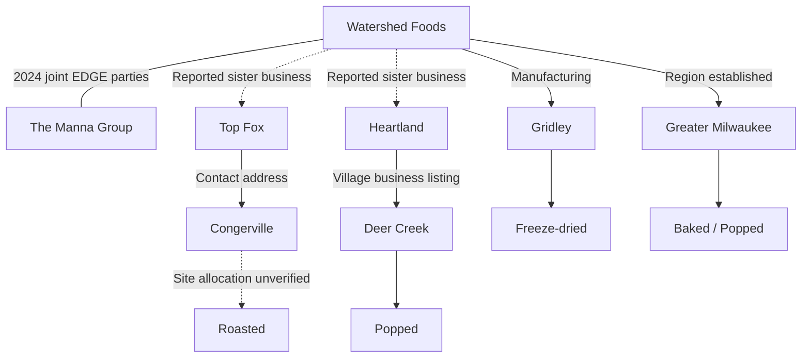

# B. Facility and capability graph

Baseline researched 17 September 2026. Every relationship retains its evidence class. Current public evidence does not establish actual customer mix, purchasing, recipes, installed OT, utilization, contracts or inventories.

| View | Evidence | Public precision | Platforms / attribution limits | Verify |
| --- | --- | --- | --- | --- |
| Gridley | CONFIRMED | Public facility address: 202 North Ford Street | Freeze-dried; Core manufacturing; public expansion benchmark is 31 December 2026. | Expansion commissioning; Utility contracts and backup capacity; Inbound crop origins; Cold-storage capacity; Rail use and carrier allocation [Illinois DCEO: 2024 EDGE agreement](https://dceo.illinois.gov/content/dam/soi/en/web/dceo/expandrelocate/incentives/edge_agreements/2024-watershed-foods-llc-and-the-manna-group-llc-edge-agreement-redacted.pdf) (retrieved 2026-09-17); [Watershed: Careers](https://watershedfoods.com/careers) (retrieved 2026-09-17) |
| Congerville / Top Fox | CONFIRMED | Public business contact address: 1781 US Highway 150 | Roasted; Seed-snack brand and public Congerville presence; production footprint requires confirmation. | Exact production allocation; Seed origins and contracts; Roasting utilization; Utility provider [Top Fox: About](https://topfoxsnacks.com/pages/about) (retrieved 2026-09-17); [Food Business News: Heartland transition](https://www.foodbusinessnews.net/articles/29579-watershed-foods-to-enter-popcorn-market-via-new-business-unit) (retrieved 2026-09-17) |
| Deer Creek / Heartland | CONFIRMED | Village business directory: 404 E. First Avenue | Popped; Popcorn business; 2026 equipment transition and expansion announced. | Transaction close; Added shifts and lines commissioned; Expansion completion; Shipping contracts [Village of Deer Creek: Businesses](https://www.deercreekillinois.org/businesses.html) (retrieved 2026-09-17); [Food Business News: Heartland transition](https://www.foodbusinessnews.net/articles/29579-watershed-foods-to-enter-popcorn-market-via-new-business-unit) (retrieved 2026-09-17) |
| Greater Milwaukee | CONFIRMED | Region only: Greater Milwaukee, Wisconsin | Baked, Popped; Company-described operation; regional weather and labor watch only. | Facility identity and municipality; Exact processes and line allocation; Legal operating entity; Utility and transport exposure [Watershed: Careers](https://watershedfoods.com/careers) (retrieved 2026-09-17) |
| Bloomington-Normal | INFERRED | Uncorroborated office lead: Bloomington-Normal, Illinois | ; Do not model as additional manufacturing capacity. | Current headquarters designation; Office or operating function; Facility status [Watershed public company profile](https://www.linkedin.com/company/watershed-foods) (retrieved 2026-09-17) |

The interactive graph is in Company & graph. Its full portable representation is [`data/graph.json`](../data/graph.json), including node types, edge classes, citations, retrieval dates and separate historical evidence dates.

No facility-security layout, access weakness, backup configuration, employee movement or sensitive operational detail is exposed. NWS state feeds require county/time matching before attaching an alert to a facility. Wisconsin cannot receive precise facility alerts until the site is sufficiently established.
